# Hookshot Heroes


Hookshot Heroes is a classic maze puzzle solver game with RPG elements and a fun story.

In a realm shrouded in mystery, Lidia, a brave and determined heroine, embarks on a perilous journey. 
Drawn by the allure of hidden treasures and ancient secrets, she fearlessly enters the dungeons. 
Empowered by the legendary "hookshot," a grappling hook that fused to her arm, Lidia defies danger and navigates treacherous terrain. 
With each triumph over enemies and the acquisition of precious loot, she inches closer to the ultimate prize. Driven by unwavering bravery, 
Lidia's quest for glory unfolds as she unravels the depths of the dungeons, leaving an indelible mark upon the annals of Eldoria's history.

The game can be launched from IntelliJ IDE by selecting the "Run" configuration and pressing the green Run button.
Alternatively, the game JAR file artifact can be built from the IDE and then run the command:

```shell
java -jar HookshotHeroes.jar
```

GitHub repository (private): https://github.com/JerryCBH/159261-project

---
## Ideas and Inspiration
When discussing 2D video games, their design, development and studio’s ability to overcome limitations, it has hard not to included Nintendo’s contribution with the likes of Zelda and Mario. Two franchises still around today.

When discussing with our team, we all showed interested in puzzle games. With the skills and knowledge that we have gained through this course and our assignment 1, we thought that we had a good foundation for building a dungeon crawling Zelda like game. 

The room-based puzzles of Zelda’s dungeons were the source of inspiration for us to build a game, that has players complete grid-based maze puzzles to procced to the next level.

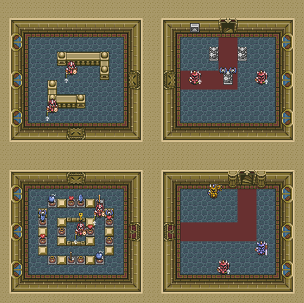

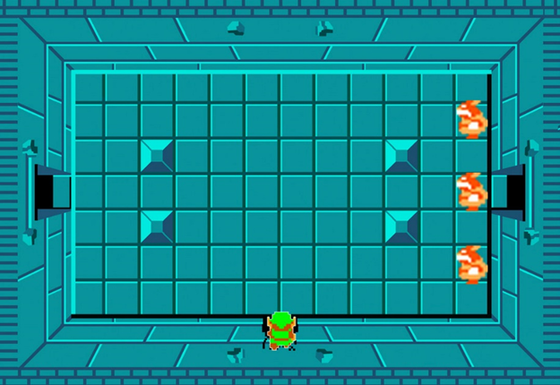

To enhance the game and the player’s experience, we wanted to add an ability that improved the players simple grid-based movement. To achieve this, we decided to give the player a grappling hook ability. Not only does this make the player’s movements more enjoyable, but it also allowed us to develop the level / maze design around this ability.

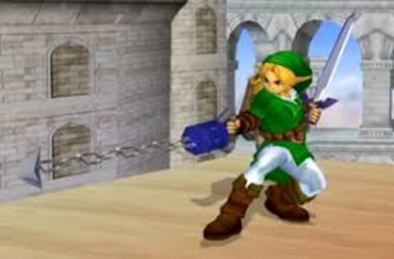
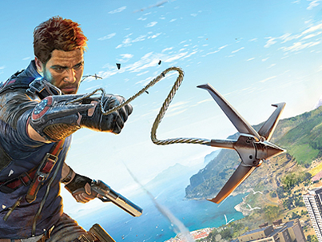
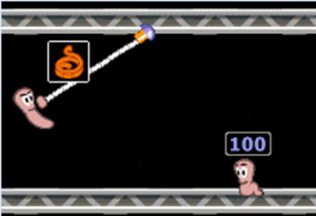

## Level Design
With the key ideas of a rooms, where the player needs to navigate a maze, using standard movement and a grappling ability, we were able to start working on the game design.  
This started with researching different maze ideas and applying this knowledge to our game’s mechanic. From here we were able to start to design each room’s layout and make sure the maze and game play fitted together.

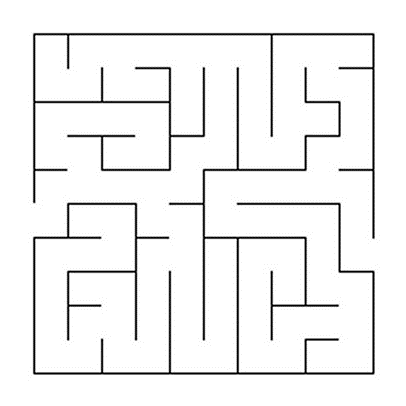

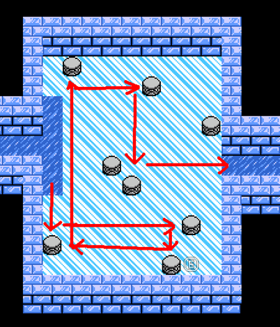

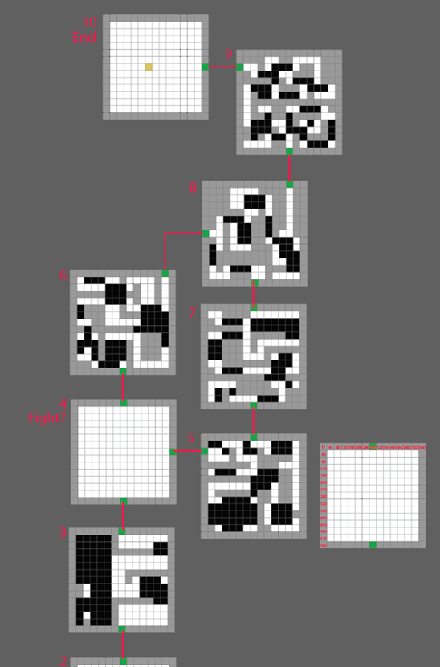

To merry the maze style and grappling ability together, we used a ground hazard in which the player would need to traverse with their grabbling ability in order to continue. Rules were placed on the grappling ability in order to define what was achievable for the player while using the ability. This then helped us fine tune the room design.

To add to the difficulty of some of the rooms, additional treasure chest are placed as optional tasks for the player. Solving how to collect these, while also finding how to complete the level betters the player’s score.

---

## Game Features
- Use Grapple to hook onto walls and jump across obstacles.
- 10 unique dungeon mazes to solve.
- 2 boss fights.
- Treasures to collect to increase score and eat fruit barrels to replenish health.
- 2 player mode, where players race to see who can complete the rooms the fastest with the best score.
- Quest mode, where player(s) protect and guide the NPC character Avalon through the dungeon.
- Read your character’s thoughts as they collect items and battle enemies.
- Suspenseful music and immersive sound effects.
- Character / boss and item animations.
- Two end-game levels after defeating all the boss.

## About Game Design
- Non-linear game progression. Example: In level 4 we have two doors that lead to different levels. This makes the game more non-linear. This can be made more complex by adding multiple doors in each level, for instance hidden Easter egg levels.
- NPC AI has patrol, seek, wait states. More states in state machines can be added and more variety of state machines can be added. We have 3 state machines: NPC enemy, NPC follower, BGC (background character) follower / wonderer. There are parameters in state machine classes that tunes the behaviour via reaction time: how long to make a decision during each state. Increasing the reaction time makes the character slower and less agile. Possible improvements outside scope of this project: Introduce cruising state for flying terror that goes around in path of large circle, mimic flying behaviours. Add routing algorithms, currently the NPC calculates the shortest Euclidean distance and not considering path blocked by obstacle, so npc can get stuck from time to time.
- Friendly NPC can make random comments and reactions. Comments are from chat GPT. Each ChatGPT request runs on a different thread, no penalty on performance. The comments are made when the NPC state machine state changes or if the NPC health / score increase or decrease. There is also an idle timer, so NPC will say something every couple of seconds. This is made more random by adding random number generator to decide to speak or not when comment timer is up. We can make it more realistic by introducing more comment types. We have about 5 comment types to make remarks on different situations. If ChatGPT fails, there is a backup comment dictionary in the code.
- Comment speech bubble and score notifications are displayed beside characters on the screen in descending order. They follow characters.
- The use of Linked List / Array List / Queues as a means of communication for in-game events. There are Audio Queue, Animation Queue, Elimination Queue, Spawn queue. In-game object raises requests to these queues to be processed by game engine to play audio / animation at certain location and time, due to in-game events. These queues decouples the classes.
- World builder class: we can easily control addition of different types of objects in each level.
- Level class: Embodies a level. Returns a list of exits / entry doors. Contains a link to the next level object. Paints screen with details.
- Collision detection logic is a bit messy as it happens in two places rather than one. One in the in-game objects themselves, another at the world level. This can be improved.
- The classes are designed to support dependency injection, we can adopt a DI framework, but it's out of scope. Eg: State Machine all inherit IStateMachine interface and can be injected from DI or factory classes depending on the NPC class type.
- Grid design makes the movement not smooth enough. We can add smoothing to character / NPC movements.
- Bouncing ball projectile, explodes when runs out of energy.
- Smoke animation.
- We have three theme music, played at different level.
- 3 types of game: Single / double / quest (Hardest).
- NPC character generation - the NPC characters in the end game levels are randomly generated. We can randomly generate quest character as well if we have enough time.
- Quest characters follows closet players in quest, can jump with hook-shot, tracks a score.
- Consumable items like coins / vegetable cabbages / bombs are generated randomly. Improvements can be made such that they spawn on walkable area only. They could spawn inside walls and become inaccessible.

## Game Architecture
The game launches a start menu that allows players to select game mode and view help files. The start menu will then instantiate the game engine: ````HookshotHeroesGameEngine````. The game engine class will build the in-game menu bar at start up.

Below is an UML diagram of the game architecture and classes. At the top level we have the ```HookshotHeroesGameEngine``` class that extends the ```GameEngine``` class. 
It instantiates a different type of world builder class based on user selected game mode options, and calls render and update methods on the world class.
The world builder classes create an ```IWorld``` object that represent the game world or the world class. The constructor of the world class receives essential game classes like ```GameImage```, ```GameAudio``` and ```GameOptions```.
The world class uses a grid based system when locating objects on the screen. 

The world class is responsible for maintaining a list of in-game objects that implements ```IWorldObject``` interface. All object that appears in the game must implement this interface.
When a keyboard event is detected, the world class will call ````Move()```` method on every world object and receives the updated new grid cell position from each object (only if the object can respond to key press and move). 
The world class will do a collision check on these new position grid cells and handles any collisions.

Collisions are also handled by object as they calculate their next move. In the future, we can improve this by having collision completely handled by object themselves, rather than partially by the world class.

The world class is also responsible for handling playing of audio and animation. When two world object collide or interact when coming to proximity, the objects will submit audio requests or animation requests to the world class. This is done by adding request objects to audio and animation queues provided by the world class. In every update cycle, the world class will check these queues and process them by playing audio or playing animation at a certain grid cell location.

If a world object needs to be removed, for instance, a consumable item being consumed or a defeated enemy, the object will send an elimination request to the world class's elimination queue. The world class checks the queue at each cycle and removes any eliminated objects from its list of world objects.

The world class also contains a reference to the current level object as ```ILevel```. 

```ILevel``` represents a level / maze, at every game cycle it is called by ```render()``` method to render the level. It contains methods that returns the terrain of each level. ```GetWallCells()``` returns a list of wall grid cells, while ```GetLavaCells()``` return the lava regions. Game objects use these cells to check for collision and accessible path.

```ILevel``` also returns the entry grid cell or exit grid cells and a reference to the next levels (```NextLevelInfo[]```). When player is moving, the player class will check if the player's current location has reached exit grid cell returned by ```ILevel```. If it does, it will invoke ```ĪnitializeLevel()``` method on the ```HookshotHeroesGameEngine``` to re-create the wall and the next level. During this process, the current players will be injected into the new world so that the scores and lives are persisted across levels. The starting grid cell of the players are also determined by the current level object.

```Ilevel``` can return multiple exit grids and each points to a different next ```ILevel```. It can also return the previous level and previous starting position to allow players to navigate backwards, however, this is not enabled in the final game.

Here is a list of in-game objects:
- Player
- NPC (AI follower in quest mode, instantiates a state machine for movements)
- BGC (Randomly generated background AI characters, instantiates a state machine for movements)
- Guide (Quest giver / guide - Render at fixed location and cannot move on level map)
- Various speech bubbles and notification bubbles.
- Coin.
- Bomb.
- Veggie barrel (Health item).
- Bouncing Ball (Boss projectile).
- Grapple.
- Minotaur (AI Boss).
- GhostWizard (AI Boss).
- Skeleton (AI guards).
- Fly Terror (AI guards).

Each ```IWorldObject``` supports methods like ```render()``` and ```update()```.
Each knows how to render themselves onto the game screen and how to handle damages or collision with other world objects.


The ```GameAudio``` class loads all game audio files at startup.

The ```GameImage``` class loads all game object sprites at startup.

The ```GameOptions``` class loads player selected game options from the game menu bar.

## Game AI
There are two main types of state machines used by the AI: ```NPCSimpleStateMachine``` and ```FollowerStateMachine```.

```NPCSimpleStateMachine``` is used by AI enemies. It has only two states: Patrol and Seek. Each state has its own reaction time. Only when the reaction time is exceeded, will the AI take some action at the state.
In the Patrol state, the AI use a random number generator to pick the next direction to move to. 
After the move, it scans for locations of players in the level. If the Euclidean distance is less than the Sight parameter of the AI, it will transition to the Seek state.
In Seek state, the AI will go through each possible direction it can take as a next move, and calculate the Euclidean distance for each move and the player's locations. Picking the move with the least Euclidean distance with the players as the optimum move. After making the move, it scans for the locations of players and the states repeat.

The AI enemies attack the players by collision with player's location until player loses all lives.

The enemy AI can be made more efficient by reducing the reaction times at each state and also increasing the sight range parameter. For example the Flying Terror has a sight radius of 39 grid rows. The Minotaur boss has a fast seek time.

```FollowerStateMachine``` is used by AI NPC and BGC players. Apart from Patrol and Seek state, it has an extra wait state where if the character is within the Wait range, it will wait around the player. There is a reaction time for NPC comments as well. When the time is up, the random number generator will decide if the NPC should say some comments or not. The comments are retrieved from ChatGPT, and is based on the current state of the NPC.


The below diagram shows all the state machines. Most state machines are variants of ```NPCSimpleStateMachine``` and ```FollowerStateMachine``` with different tuned parameters and reaction times.


## ChatGPT and NPC Reactions
ChatGPT API is used to get more realistic NPC and player reactions. When the player or NPC or their grapples collided with another game world object, the ```SpeechService``` is invoked. The ```SpeechService``` takes an enumeration of comment type and calls the ```ChatGPTConnector``` to retrieve response. If the response fails to be received, a hardcoded comment dictionary inside the ```SpeechService``` will be used as a backup.

The ```SpeechService``` will send an ```AnimationRequest``` to animation queue to draw the speech bubbles.

The animation request objects are sorted based on created time stamp in descending order. So the speech bubbles will appear in descending order with the latest comment or score notifications on the top.

## NPC Character Generation

The game loads 30+ character sprites and can randomly generate NPC players. The character sprites are stored in ```HashMap``` with the key being the type of character.

This is loaded by ```GameImage``` class's ```GetRandomNPC()``` method.

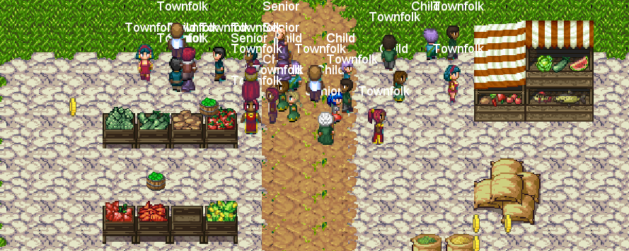

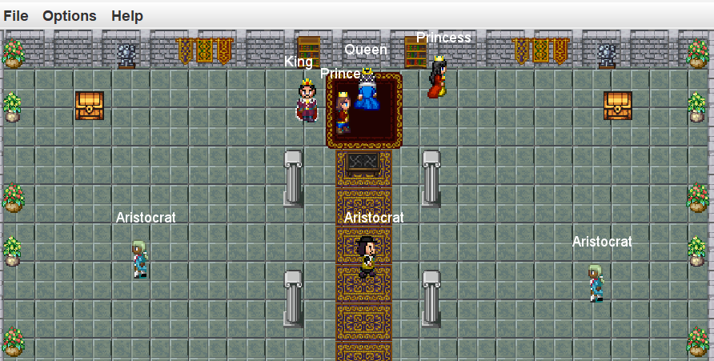

---
## How to play

Choose the game mode from the main menu screen and enter the maze:

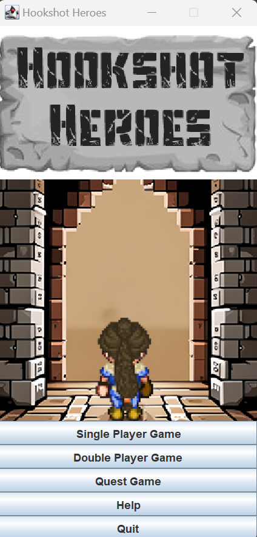

### Single Player Mode

Navigate the dungeons solo, collecting as many coins and treasure, as quickly as
you can to complete the game with the best score.

### Double Player Mode

You and a friend will compete against each other to see who can get the highest
score. Pick between collecting coins or opening chests or getting to the exit
the fastest. The first player to the exit will end the level for both players.
Level knowledge, speed and tactics, will help you secure the win.

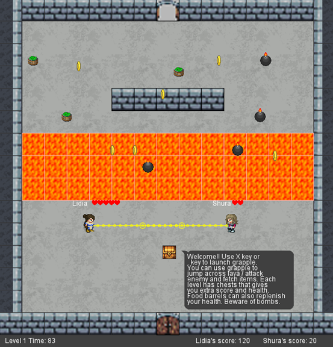

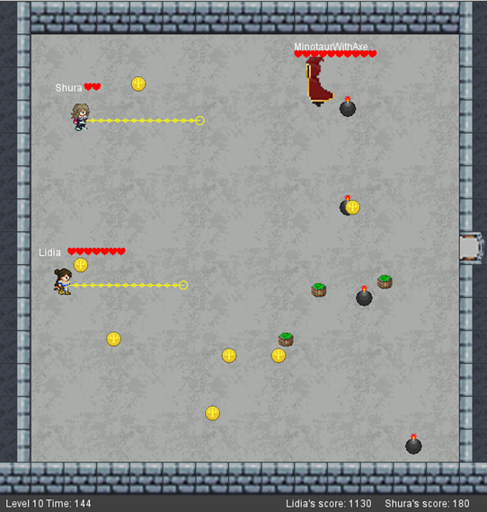

### Quest Mode

Help Avalon escape the Dungeon. This can be played either in Single or Double player.
Avalon will follow you and your friend. Watch over and guide her through the dungeons.

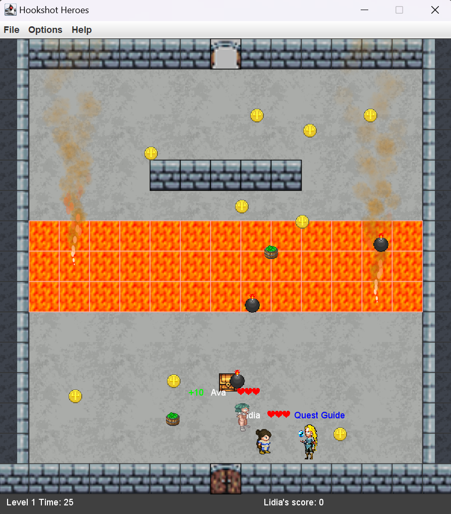

### Controls

Player One: Use 'W', 'S', 'D' and 'A' to move Lidia around the dungeon.
Use 'X' to fire the 'hookshot'

Player Two: Use the arrow keys to move Shura around the dungeon
Use '.' to fire the 'hookshot'

The hookshot can be used to:
- jump over the lava
- to collect items
- destroy bombs
- attack enemies

Be careful though, as the hookshot only has a limited range.

Collect coins to increase your score by 10.

Open treasurers to boost your score by 100 and health by 2.

Collect plant baskets for extra lives.

Collision with bombs, results in a loss of life.

Landing in the lava, results in a loss of life.

Each player starts with 3 lives and can gain a maximum of 6 lives.

Destroy bombs or damage enemy with hookshot increases score by 10.

Navigate 10 unique dungeons!

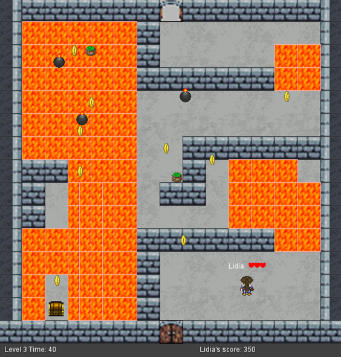

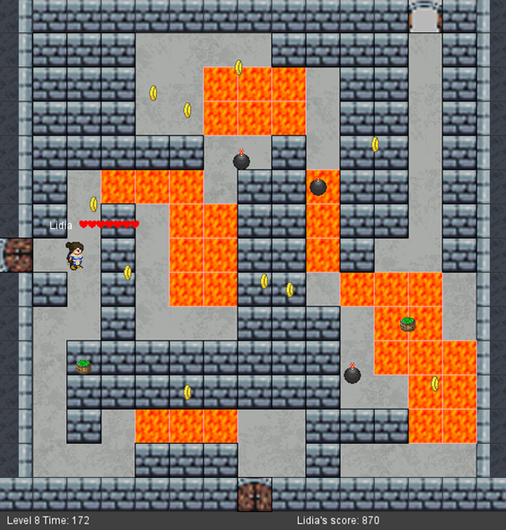

Two unique boss fights:

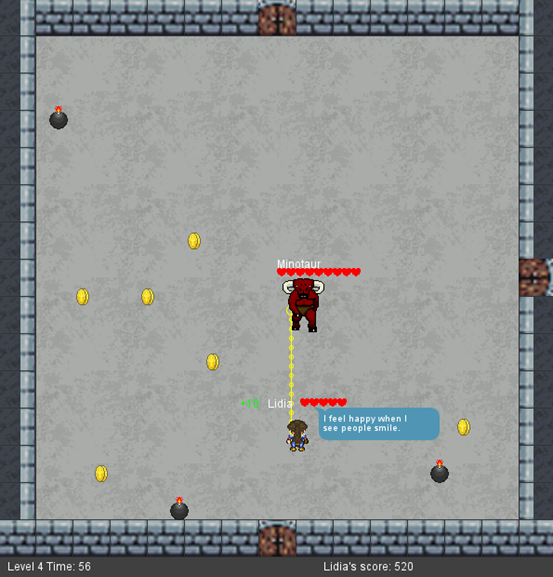

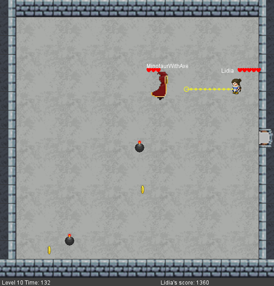

### Game Options

- Change from Single Player Mode to Double Player Mode
- Enable / Disable music

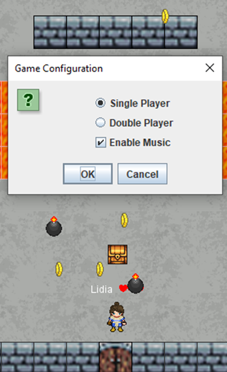

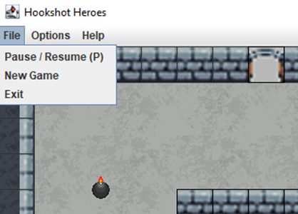

---
## Game Story

In a realm shrouded in mystery, Lidia, a brave and determined heroine, embarks on a perilous journey.
Drawn by the allure of hidden treasures and ancient secrets, she fearlessly enters the dungeons.
Empowered by the legendary "hookshot," a grappling hook that fused to her arm, Lidia defies danger and navigates treacherous terrain.
With each triumph over enemies and the acquisition of precious loot, she inches closer to the ultimate prize. Driven by unwavering bravery,
Lidia's quest for glory unfolds as she unravels the depths of the dungeons, leaving an indelible mark upon the annals of Eldoria's history.

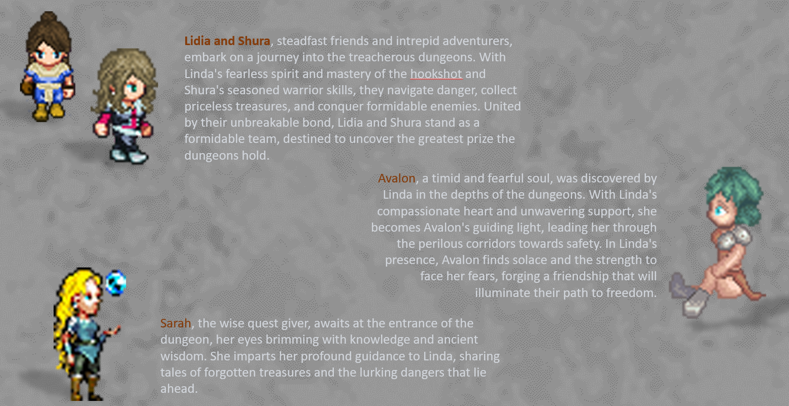

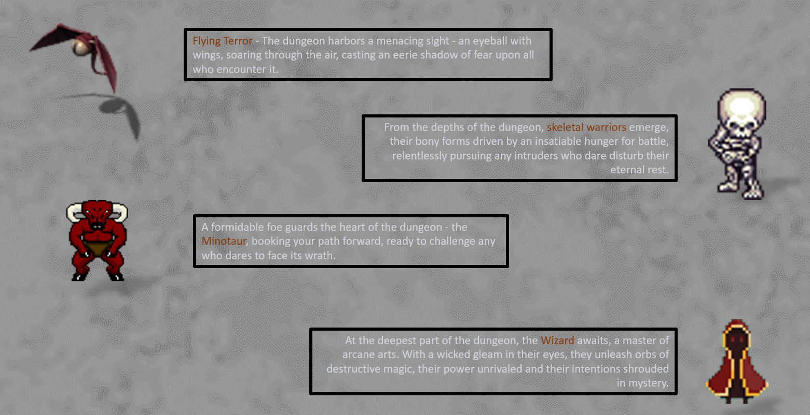

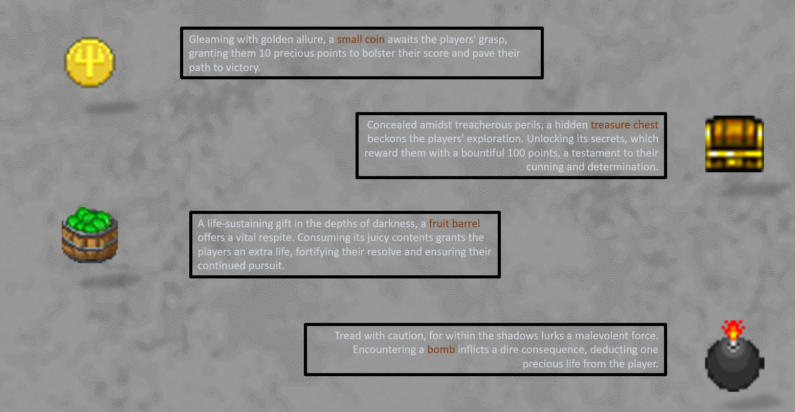

---
## Group Member's Contributions

### Bryce Cameron
-	level layout design.
-	Level layout coding.
-	Menu design.
-	Boss fights design.
-	Documentations.
-	General bug fixes.
-	Play testing.

### Josh Anderson
-	Game design and ideas.
-	Grapple mechanism and design.
-	Play testing.

### Helen McCartney
-	Game design and ideas.
-	Story ideas
-	Play testing.

### Jerry Hsiung
-	Game software architecture design, core classes and base game functionalities.
-	Animations, audio and sound.
-	Game object interactions / collisions / scores.
-	NPC dialogues / Chat GPT / notifications.
-	Game AI designs.
-	GitHub repository setup and integration of code from team members.
-	Bug fixes.
-	Play testing.

---

## Game Assets

AntumDeluge. (2017). Barrel Sprites [Digital image]. OpenGameArt. Retrieved from https://opengameart.org/content/barrels-mage-city-arcanos-remix

bluecarrot16. (2018). LPC Medieval Village Decorations [Digital image]. OpenGameArt. Retrieved from https://opengameart.org/content/lpc-medieval-village-decorations

bluecarrot16. (2018). LPC Terrains [Digital image]. OpenGameArt. Retrieved from https://opengameart.org/content/lpc-terrains

Bryce. (2023). Floor Sprite [Digital image].

Bryce. (2023). Main Image [Digital image].

davesch. (2014). Lava Sprite [Digital image]. OpenGameArt. Retrieved from https://opengameart.org/content/16x16-and-animated-lava-tile-45-frames

Danimal. (2021). Flying Terror [Digital image]. OpenGameArt. Retrieved from https://opengameart.org/content/flying-terror

diamonddmgirl. (2016). Edited and Extended 24x32 Character Pack [Digital image]. OpenGameArt. Retrieved from https://opengameart.org/content/edited-and-extended-24x32-character-pack

Fesliyan, D. (2016). Scarey Atmospheres Ch 2. [Audio file]. Retrieved from https://www.fesliyanstudios.com/royalty-free-music/download/scarey-atmospheres-ch-2/163

Gaming Sound FX. (2021). Coin Sound Effect [Audio file]. Retrieved from https://www.youtube.com/watch?v=mQSmVZU5EL4

IndigoFenix. (2019). Bomb Sprite [Digital image]. OpenGameArt. Retrieved from https://opengameart.org/content/bomb-2

jalastram. (2014). Monster Sounds [Audio files]. OpenGameArt. Retrieved from https://opengameart.org/content/monster-and-creatures-sound-effects-pack-001 https://opengameart.org/content/monster-sound-tutorial

K0huro. (2022). Mage Sprite Sheet [Digital image]. Reddit. Retrieved from https://www.reddit.com/r/PixelArt/comments/raaip5/an_8_directional_sprite_of_a_mage_for_a_game_of/

Leonard Pabin. (2012). Avalon Sprite [Digital image]. OpenGameArt. Retrieved from https://opengameart.org/content/whispers-of-avalon-archer-sprite

morgan3d. (2013). Coin Sprite [Digital image]. OpenGameArt. Retrieved from https://opengameart.org/content/spinning-gold-coin

Redshrike. (2011). Castle Interior Sprites [Digital image]. OpenGameArt. Retrieved from https://opengameart.org/content/rpg-indoor-tileset-expansion-1

Redshrike. (2011). Indoor RPG Tileset [Digital image]. OpenGameArt. Retrieved from https://opengameart.org/content/16x16-indoor-rpg-tileset-the-baseline

Reemax. (2019). Whip Sound Effect [Audio file]. OpenGameArt. Retrieved from https://opengameart.org/content/whip-sound

Siegmund, D. (2011). Dungeon Wall Sprite Sheet [Digital image]. OpenGameArt. Retrieved from https://opengameart.org/content/16x16-pixel-art-dungeon-wall-and-cobblestone-floor-tiles

StarNinjas. (2021). Crunch Sound Effect [Audio file]. OpenGameArt. Retrieved from https://opengameart.org/content/7-eating-crunches

Unnamed. (2016). Explosion Sound Effect [Audio file]. OpenGameArt. Retrieved from https://opengameart.org/content/9-explosion-sounds

Wolfgang_. (2017). Boss Music [Audio file]. OpenGameArt. Retrieved from https://opengameart.org/content/lava-area-theme

Yamilian. (2012). Lidia Sprite Sheet [Digital image]. OpenGameArt. Retrieved from https://opengameart.org/content/lpc-heroine

Yamilian. (2012). Shura Sprite Sheet [Digital image]. OpenGameArt. Retrieved from https://opengameart.org/content/lpc-heroine-2

ZaPaper. (2014). Animated Water and Waterfalls [Digital image]. OpenGameArt. Retrieved from https://opengameart.org/content/lpc-animated-water-and-waterfalls

Zabin. (2013). RPG Tiles - Cobble Stone Paths, Town Objects [Digital image]. OpenGameArt. Retrieved from https://opengameart.org/content/rpg-tiles-cobble-stone-paths-town-objects

Blarumyrran. (2012). Sara Sprite Sheet [Digital image]. OpenGameArt. Retrieved from https://opengameart.org/content/sara-2-0

Mageonduty. (2021). Pretty Maiden - Medieval Fantasy Game Cheerful Opening [Audio file]. OpenGameArt. Retrieved from https://opengameart.org/content/pretty-maiden-medievalfantasy-game-cheerful-opening
